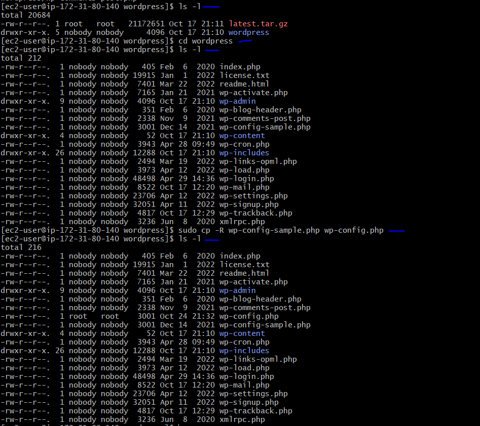
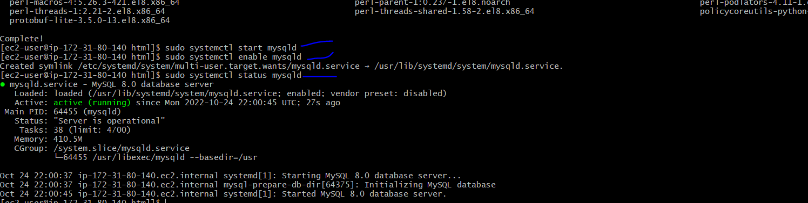

# **WEB SOLUTION WITH WORDPRESS**

### Storage infrastructure will deployed on two Linux servers and a basic web solution using WordPress. **WordPress** is a free and open-source content management system written in **PHP** and paired with MySQL or MariaDB as its backend Relational Database Management System (RDBMS).
### This task consist of two parts;
* ### Configure storage subsystem for Web and Database servers based on Linux OS. This gives practical experience of working with disks, partitions and volumes in Linux.
* ### Install WordPress and connect it to a remote MySQL database server. This is to understand deploying Web and DB tiers of Web solution.

### **Three-tier Architecture** is a client-server software architecture pattern that comprise of 3 separate layers.


### **1. Presentation Layer (PL)**: This is the user interface such as the client server or browser on your laptop.
### **2. Business Layer (BL):** This is the backend program that implements business logic. Application or Webserver
###	**3. Data Access or Management Layer (DAL):** This is the layer for computer data storage and data access. Database Server or File System Server such as FTP server, or NFS Server.

## Use RedHat OS for this project (it has a fully compatible derivative – CentOS)

### **LAUNCH AN EC2 INSTANCE THAT WILL SERVE AS “WEB SERVER”.**

### **Step 1 — Prepare a Web Server**
* Launch an EC2 instance that will serve as "Web Server". Create 3 volumes in the same AZ (availablity zone) as your Web Server EC2, each of 10 GiB.
* Attach all three volumes one by one to your Web Server EC2 instance and subsequently access the server via SSH from terminal.

*Use `lsblk` command to inspect what block devices are attached to the server. Note names of your newly created devices. All devices in Linux reside in /dev/ directory. Inspect it with `ls /dev/`and make sure you see all 3 newly created block devices there – their names will likely be xvdf, xvdh, xvdg;*

`lsblk`


*Use `df -h` command to see all mounts and free space on your server;*

`df -h`

*Use `gdisk` utility to create a single partition on each of the 3 disks;*

`sudo gdisk /dev/xvdf`


*Use lsblk utility to view the newly configured partition on each of the 3 disks;*

`lsblk`


*Install lvm2 package using;*

`sudo yum install lvm2`


*Run `sudo lvmdiskscan` command to check for available partitions;*

`sudo lvmdiskscan`

*Use pvcreate utility to mark each of 3 disks as physical volumes (PVs) to be used by LVM;*

`sudo pvcreate /dev/xvdf1 /dev/xvdg1 /dev/xvdh1`

*Verify that your Physical volume has been created successfully by running sudo pvs;*

`sudo pvs`


*Use vgcreate utility to add all 3 PVs to a volume group (VG). Here, "vg-webdata" is used as the name of VG;*

`sudo vgcreate vg-webdata /dev/xvdh1 /dev/xvdg1 /dev/xvdf1`

*Verify that your VG has been created successfully by running;*

`sudo vgs`


*Use lvcreate utility to create 2 logical volumes. apps-lv (Use half of the PV size), and logs-lv Use the remaining space of the PV size. NOTE: apps-lv will be used to store data for the Website while, logs-lv will be used to store data for logs;*

`sudo lvcreate -n apps-lv -L 14G vg-webdata`

`sudo lvcreate -n logs-lv -L 14G vg-webdata`

*Verify that your Logical Volume has been created successfully by running sudo lvs;*

`sudo lvs`


*Verify the entire setup;*

`sudo vgdisplay -v #view complete setup - VG, PV, and LV`

`sudo lsblk`


*Use mkfs.ext4 to format (prepare) the logical volumes with ext4 filesystem;*

`sudo mkfs -t ext4 /dev/vg-webdata/apps-lv`

`sudo mkfs -t ext4 /dev/vg-webdata/logs-lv`

*Create /var/www/html and /home/recovery/logs directories to store website files and backup of log data respectively;*

`sudo mkdir -p /var/www/html`

`sudo mkdir -p /home/recovery/logs`

*Mount /var/www/html on apps-lv logical volume*

`sudo mount /dev/vg-webdata/apps-lv /var/www/html`

*Use rsync utility to backup all the files in the log directory /var/log into /home/recovery/logs (This is required before mounting the file system)*

`sudo rsync -av /var/log/. /home/recovery/logs`


*Mount /var/log on logs-lv logical volume. (Note that all the existing data on /var/log will be deleted. That is why previous step (rsync) above is very important)*

`sudo mount /dev/vg-webdata/logs-lv /home/recovery/logs`

*Restore log files back into /var/log directory*

`sudo rsync -av /home/recovery/logs/. /var/log `


*Verify files has been restored to the logs file*

`sudo ls -l /home/recovery/logs`

*Retrieve the UUID of the device which will be subsequently used to ensure mount persists incase of a server restart;*

`sudo blkid`


## **UPDATE THE */ETC/FSTAB* FILE**

*Update /etc/fstab file so that the mount configuration will persist after restart of the server. Access fstab using a prefered editor and update the UUID retrieved from the previous step and map it to the appropriate directory as indicated in the sceen shots*

`sudo vi /etc/fstab`

*Test the configuration and reload the daemon;*

`sudo mount -a`


*Reload daemon;*

`sudo systemctl daemon-reload`

*Verify your setup by running df -h, output must look like this:*

`df -h`


### **Step 2 — Prepare the Database Server** Launch a second RedHat EC2 instance that will have a role – ‘DB Server’. Repeat the same steps as for the Web Server, but instead of apps-lv create db-lv and mount it to /db directory instead of /var/www/html/.

`lsblk`

*Use gdisk utility to create a single partition on each of the 3 disks;*

`sudo gdisk xvdhf`


*Install lvm2 package using;*

`sudo yum install lvm2 -y`


*Use pvcreate utility to mark each of 3 disks as physical volumes (PVs) to be used by LVM;*

`sudo pvscreate /dev/xvdf1 /dev/xvdg1 /dev/xvdh1`

*Use vgcreate utility to add all 3 PVs to a volume group (VG). Here, "vg-dbase" is used as the name of VG*

`sudo vgcreate vg-dbase /dev/xvdf1 /dev/xvdg1 /dev/xvdh1`

*Verify volume group creation;*

`sudo vgs`


*Use lvcreate utility to create logical volumes. db-lv (in this case using 20G of PV size);*

`sudo lvcreate -n db-lv -L 20G vg-dbase`

*Verify that your Logical Volume has been created successfully by running sudo lvs;*

`sudo lvs`

*Create the mount point or directory (db) in the root directory*

`sudo mkdir /db`

*Prepare the database server by formating it with mkfs.ext4 and ensure there is nothing to backup before mounting it;*

`sudo mkfs.ext4 /dev/vg-dbase/db-lv `

`ls -l /db`

*Mount the LV to the db*

`sudo mount /dev/vg-dbase/db-lv /db`


*Retrieve the UUID of the device which will be subsequently used to ensure mount persists incase of a server restart;*

`sudo blkid`

*Using vim to access the fstab file and assign UUID as shown in screen shot;*

`sudo vi /etc/fstab`

*Test mount and restart daemon;*

`sudo mount -a`

*Verify your setup by running df -h;*

`sudo systemctl daemon-reload`


*Note: Ensure security group on AWS permits traffic between the web server and the database*

### **Step 3 — Install WordPress on your Web Server EC2**

*Update Linux server (CentOS) for the web and database servers;*

`sudo yum update -y`


*To install PHP and it’s depemdencies*

`sudo yum install https://dl.fedoraproject.org/pub/epel/epel-release-latest-8.noarch.rpm`

`sudo yum install yum-utils http://rpms.remirepo.net/enterprise/remi-release-8.rpm`


*Retrieve the versions of php so the latest can be identified and install;*

`sudo yum module list php`

*Reset php module so current version can be install;*

`sudo yum module reset php`

*Enable the latest version of php;*

`sudo yum module enable php:remi-8.0`


*Installing php;*

`sudo yum install php php-opcache php-gd php-curl php-mysqlnd`


*Check version of php, Start php-fpm, enable it and check the status;*

`php -v`

`sudo systemctl start php-fpm`

`sudo systemctl enable php-fpm`

`sudo systemctl status php-fpm`


*Enable SELinux so that it can work together with the Apache HTTPS server; This allows apache to execute php code via php-fpm *

`setsebool -P httpd_execmem 1`

*Starting apache and checking the status;*

`sudo systemctl start httpd`

`sudo systemctl status httpd`


*Confirm that apache is up view web browser using the public IP of server;*


*View files in the html directory;*

`sudo ls -l /var/www/html`

*Create wordpress directory for the app and subsequently navigate into the directory.*

`mkdir wordpress`

`cd wordpress`

*Download wordpress and copy wordpress to /var/www/html ;*

`sudo wget http://wordpress.org/latest.tar.gz`


*Estract wordpress (which is a zip file) to perform all configurations. This will also contain a folder named wordpress;*

`sudo tar xzvf latest.tar.gz`


*View extracted files in folder and navigate to the wordpress folder. Subsequently view files in the nested wordpress folder;*

`ls -l`

`cd wordpress`

`ls -l`

*Copy the wp-config-sample.php to wp-config.php (wp-config.php was created in this process as it did not exist);*

`cp -R wp-config-sample.php wp-config.php`

`ls -l`



*Navigate back to the base wordpress directory and copy wordpress/ to /var/www/html;*

`cd ..`

`ls`

`sudo cp -R wordpress/ /var/www/html`

*Access the html directory to view the . Then ensure that this directory is empty;*

`cd /var/www/html`

`ls -l`

`sudo rm -rf wordpress/`

`sudo rm -rf lost+found/`

`ls -l`

*Change directory to the base wordpress directory while also confirming the removed content earlier;*

`ls -l`

`cd ../..`

`cd`

`ls`

`cd wordpress`

`ls -l`

*View content of the base wordpress directory;*

`ls -l wordpress`

*Now copy items in wordpress/. to /var/www/html/ and subsequently confirm content in it;*

`sudo cp -R wordpress/. /var/www/html/`

`sudo ls -l /var/www/html`


*Then change directory to the html and install mysql since this web server is also going to be acting as a client;*

`cd /var/www/html`

`ls`

`sudo yum install mysql-server -y`


*Start, enable and check status of mysql server;*

`sudo systemctl start mysqld`

`sudo systemctl enable mysqld`

`sudo systemctl status mysqld`



### Configure DB to work with WordPress: *switching to the **database server**, mysql will be installed;*

`sudo yum install mysql-server -y`


*Start, enable and check status of mysql server. The secure installation by running the interactive script;*

`sudo systemctl start mysqld`

`sudo systemctl enable mysqld`

`sudo systemctl status mysqld`

`sudo mysql_secure_installation`


*Access mysql via root user while also authenticating with set password;*

`sudo mysql -u root -p`

*Creating a database for wordpress project and view the databases;*

`create database wordpress;`

`show databases;`


*Create a user and give user privilege to the database. In this case a wildcard IP address is specify but this is not recommended in prod for security;*

`CREATE USER 'pressman'@'%' IDENTIFIED WITH mysql_native_password BY 'pressman';`

`GRANT ALL PIVILEGES ON *.* TO 'pressman'@'%' WITH GRANT OPTION;`

`FLUSH PRIVILEGES`

*Checking the database and exit;*

`select user, host from mysql.user;`

`exit`


*Setting the binding using vim to perform the edit. In this case a wildcard IP (0.0.0.0) address (anyone can connect) is specify but this is not recommended in prod for security. The restart mysql;*

`sudo vi /etc/my.cnf`

`sudo systemctl restart mysqld`


*On the webe server, navigate to the html directory, then edit wp-config.php file with the required details. The required changes are marked in the screen shot, then save and restart apache;*

`sudo vi wp-config.php`

```
<?php
/**
 * The base configuration for WordPress
 *
 * The wp-config.php creation script uses this file during the
 * installation. You don't have to use the web site, you can
 * copy this file to "wp-config.php" and fill in the values.
 *
 * This file contains the following configurations:
 *
 * * MySQL settings
 * * Secret keys
 * * Database table prefix
 * * ABSPATH
 *
 * @link https://codex.wordpress.org/Editing_wp-config.php
 *
 * @package WordPress
 */
 
// ** MySQL settings - You can get this info from your web host ** //
/** The name of the database for WordPress */
define('DB_NAME', 'wordpress');
 
/** MySQL database username */
define('DB_USER', 'pressman');
 
/** MySQL database password */
define('DB_PASSWORD', 'pressman');
 
/** MySQL hostname */
define('DB_HOST', 'localhost or the IP address of the database');
 
/** Database Charset to use in creating database tables. */
define('DB_CHARSET', 'utf8');
 
/** The Database Collate type. Don't change this if in doubt. */
define('DB_COLLATE', '');
 
/**#@+
 * Authentication Unique Keys and Salts.
 *
 * Change these to different unique phrases!
 * You can generate these using the {@link https://api.wordpress.org/secret-key/1.1/salt/ WordPress.org secret-key service}
 * You can change these at any point in time to invalidate all existing cookies. This will force all users to have to log in again.
 *
 * @since 2.6.0
 */
define('AUTH_KEY',         'put your unique phrase here');
define('SECURE_AUTH_KEY',  'put your unique phrase here');
define('LOGGED_IN_KEY',    'put your unique phrase here');
define('NONCE_KEY',        'put your unique phrase here');
define('AUTH_SALT',        'put your unique phrase here');
define('SECURE_AUTH_SALT', 'put your unique phrase here');
define('LOGGED_IN_SALT',   'put your unique phrase here');
define('NONCE_SALT',       'put your unique phrase here');
 
/**#@-*/
 
/**
 * WordPress Database Table prefix.
 *
 * You can have multiple installations in one database if you give each
 * a unique prefix. Only numbers, letters, and underscores please!
 */
$table_prefix  = 'wp_';
 
/**
 * For developers: WordPress debugging mode.
 *
 * Change this to true to enable the display of notices during development.
 * It is strongly recommended that plugin and theme developers use WP_DEBUG
 * in their development environments.
 *
 * For information on other constants that can be used for debugging,
 * visit the Codex.
 *
 * @link https://codex.wordpress.org/Debugging_in_WordPress
 */
define('WP_DEBUG', false);
 
/* That's all, stop editing! Happy blogging. */
 
/** Absolute path to the WordPress directory. */
if ( !defined('ABSPATH') )
    define('ABSPATH', dirname(__FILE__) . '/');
 
/** Sets up WordPress vars and included files. */
require_once(ABSPATH . 'wp-settings.php');
```


`sudo systemctl restart httpd`

*Disable Apache welcome page using below command  to back it up in another location*

`sudo mv /etc/httpd/conf.d/welcome.conf /etc/httpdconf.d/welcome.conf_backup`

*Accessing myslq from webserver. This is to ensure that the webserver can communicate with the database;*

`sudo mysql -h 172.31.95.8 -u pressman -p`

`show databases;`


*Access html directory on the web server then modify permissions so Apache can Wordpress;*

`ls -l`

`sudo chown _R apache:apache /var/www/html/`

`ls -l`

`sudo chcon -t httpd_sys_rw_content_t /var/www/html/ -R`

`sudo setsebool -P httpd_can_network_connect=1`

`sudo setsebool -P httpd_can_network_connect_db 1`


*Enable TCP port 80 inbound rule for the web server via the security group to allow traffic from everywhere (0.0.0.0/0). Then access portal via browser and enter the required information and install wordpress;*


*Access wordpress home dashboard*


